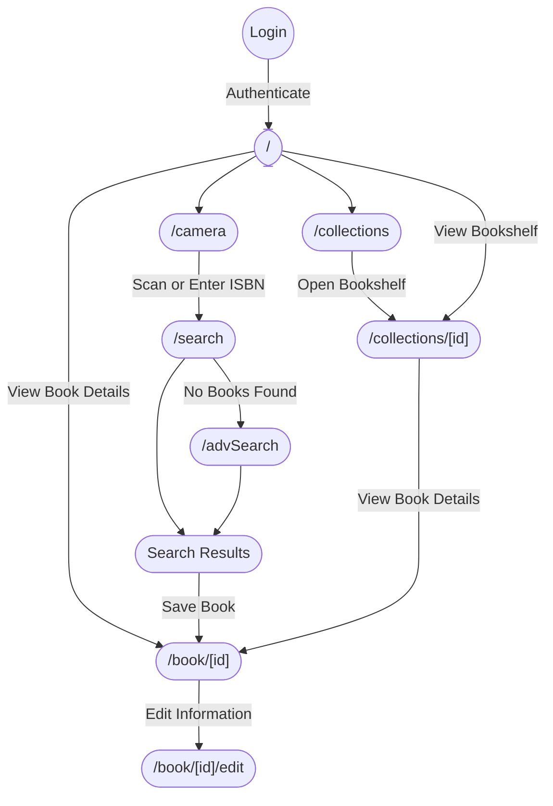

# Librakeeper Web

*― A Modern Personal Book Library Frontend*

Librakeeper Web is a sleek and user-friendly web application designed for managing your personal book collection. Built with a modern tech stack and intuitive interface, Librakeeper makes organizing and exploring your books a breeze.

## Key Features

- **Effortless Book Adding:** Quickly add books to your library by scanning ISBNs using your phone's camera or manually inputting them.
- **Detailed Book Information:** View comprehensive details for each book, including title, author, cover image, description, and more.
- **Customizable Bookshelves:** Create personalized bookshelves to categorize your books based on genre, author, or any criteria you prefer.
- **Advanced Search:** Utilize our powerful search engine to find books within your library based on various parameters.
- **Secure Authentication:** Seamlessly log in and manage your library with secure authentication powered by Firebase.

## Tech Stack

- **Next.js:** A powerful React framework for building fast and SEO-friendly web applications.
- **Mantine:** A modern React component library providing pre-built components and styling tools for a streamlined development experience.
- **TypeScript:** A strongly typed superset of JavaScript, ensuring code quality and maintainability.
- **pnpm:** A fast and efficient package manager for JavaScript.

## App Structure

Librakeeper Web is structured around a clear hierarchy of pages, each serving a specific purpose in managing your book collection. 

- `/`
    - Displays all books
    - Displays all collections (bookshelves)
    - Button to add a new book using the camera
- `/search`
    - Search for books using ISBN
    - Button to go to Advanced Search
- `/advSearch`
    - Advanced search for books 
- `/camera`
    - Captures ISBN from the camera
    - Redirects to the search with scanned ISBN
- `/collections`
    - Displays all bookshelves
- `/collections/[id]`
    - Displays all books for the bookshelf with `id`
- `/book/[id]`
    - Displays detailed info about a book with `id`
    - Contains a button to edit this book
- `/book/[id]/edit`
    - Allows editing info about a book with `id`
- `/debug`
    - Debug page to test API requests

## User Journey

The following diagram illustrates a typical user journey through the Librakeeper Web application, highlighting how users interact with various features and navigate between pages.



## Getting Started

### Prerequisites
- **Node.js**: [https://nodejs.org/](https://nodejs.org/)
- **pnpm**: [https://pnpm.io/](https://pnpm.io/)

### Installation

Clone the repository:

```bash
git clone https://github.com/your-username/librakeeper-web.git
cd librakeeper-web
```

Install Dependencies:

```bash
pnpm install 
```

### Start the Development Server

```bash
pnpm dev
```

This will start the development server, typically at `http://localhost:3000`.
